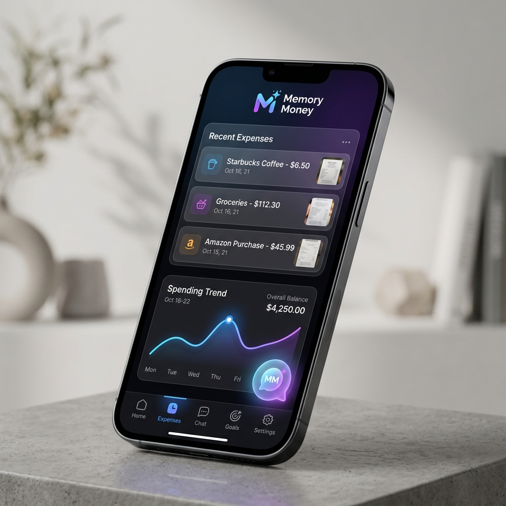

# 🧠 Memory Money — Ký Ức Chi Tiêu

[](https://nextjs.org/)
[](https://tailwindcss.com/)
[](https://opensource.org/licenses/MIT)
[](https://vercel.com/)

**Memory Money** là một ứng dụng quản lý chi tiêu hiện đại, biến những con số khô khan thành những "kỷ ức" sống động. Không chỉ đơn thuần là ghi chép thu chi, ứng dụng sử dụng AI để phân tích hóa đơn và lưu giữ cảm xúc đằng sau mỗi lần chi tiêu của bạn.

<p align="center">
  
</p>

## ✨ Tính Năng Nổi Bật

- **📸 AI OCR Receipt Scanning**: Chụp ảnh hóa đơn, AI (Gemini) sẽ tự động trích xuất số tiền, địa điểm, danh mục và tạo một đoạn "caption" đầy cảm hứng.
- **☁️ Google Drive Sync**: Tự động đồng bộ hóa toàn bộ dữ liệu và hình ảnh lên Google Drive cá nhân của bạn. Không lo mất dữ liệu, quyền riêng tư tuyệt đối.
- **💬 AI Chat Assistant**: Trò chuyện với trợ lý AI để nhận lời khuyên tài chính hoặc thống kê nhanh về thói quen chi tiêu của mình.
- **📅 Visual Storytelling**: Xem lại dòng thời gian (Timeline) và lịch (Calendar) chi tiêu dưới dạng các thẻ "Memory Card" đẹp mắt.
- **🔒 Privacy Mode**: Chế độ ẩn số tiền chỉ với một cú chạm, bảo vệ thông tin nhạy cảm khi ở nơi công cộng.
- **🎨 Modern UX/UI**: Giao diện tối giản, hiệu ứng Glassmorphism và chuyển động mượt mà với Framer Motion.

## 🛠️ Công Nghệ Sử Dụng

| Layer | Technologies |
| :--- | :--- |
| **Frontend** | Next.js 15+, React 19, TypeScript |
| **Styling** | Tailwind CSS 4, Framer Motion, Lucide Icons |
| **Artificial Intelligence** | OpenRouter (Gemini 2.0 Flash, Llama 3.3) |
| **Authentication** | NextAuth.js v5 (Google Provider) |
| **Storage** | Google Drive API v3 |
| **State Management** | Zustand |

## 🚀 Triển Khai Nhanh (Deployment)

Cách nhanh nhất để đưa dự án này lên môi trường live mà không lộ API Key:

[](https://vercel.com/new/clone?repository-url=https%3A%2F%2Fgithub.com%2F%5Byour-username%5D%2F%5Byour-repo-name%5D)

1. Connect repository của bạn với Vercel.
2. Thêm các biến môi trường từ `.env.local.example` vào **Vercel Project Settings > Environment Variables**.
3. Nhấn **Deploy**.

## 💻 Cài Đặt Local

### 1. Cấu hình môi trường
Sao chép file mẫu và điền thông tin của bạn:
```bash
cp .env.local.example .env.local
```

### 2. Khởi chạy
```bash
npm install
npm run dev
```

## 📁 Cấu Trúc Thư Mục

```text
src/
├── app/          # App Router (Pages & API)
├── components/   # UI Components (Atomic Design)
├── lib/          # Core Logic (AI, Google Drive, Utils)
├── store/        # Client-side State (Zustand)
└── types/        # TypeScript Definitions
```

## 📝 Giấy Phép

Dự án được phát hành dưới giấy phép [MIT](LICENSE).

---
<p align="center">
  <i>Developed with ❤️ by Antigravity AI</i>
</p>

