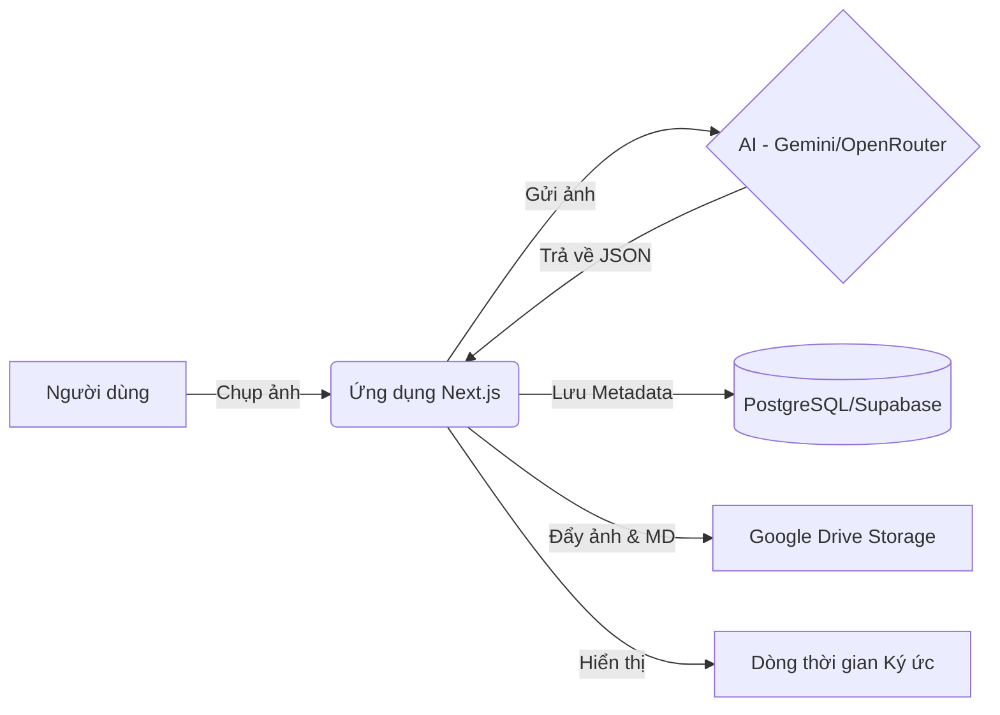

# 🧠 Memory Money — Ký Ức Chi Tiêu

[](https://nextjs.org/)
[](https://tailwindcss.com/)
[](https://www.prisma.io/)
[](https://www.google.com/drive/)

**Memory Money** là ứng dụng quản lý tài chính cá nhân thế hệ mới, tích hợp AI để biến các hóa đơn vô hồn thành những "kỷ ức" sống động. Ứng dụng không chỉ giúp bạn biết mình đã tiêu bao nhiêu, mà còn nhắc bạn nhớ về *cảm xúc* và *câu chuyện* đằng sau mỗi lần chi tiêu đó.

<p align="center">
  
</p>

---

## 🌟 Tính Năng Chủ Chốt

### 1. 📸 Trợ Lý Quét Hóa Đơn AI (OCR)
Không còn phải nhập tay từng con số. Bạn chỉ cần chụp ảnh, AI sẽ:
- **Tự động nhận diện**: Số tiền, địa điểm, và danh mục (Ăn uống, Di chuyển, v.v.).
- **Tạo Story**: Tự động viết một đoạn "caption" ngắn gọn theo phong cách Instagram dựa trên bối cảnh bức ảnh.
- **Phân tích cảm xúc**: Gợi ý tâm trạng của bạn lúc chi tiêu (vui vẻ, thư giãn, hay hối hận...).

### 2. ☁️ Lưu Trữ Tập Trung (OAuth2 Drive)
Sử dụng Google Drive cá nhân của bạn như một Cloud Storage riêng tư:
- **Tính ổn định cao**: Sử dụng cơ chế Refresh Token để vượt qua giới hạn của Service Account truyền thống.
- **Minh bạch**: Toàn bộ ảnh hóa đơn được lưu vào thư mục `MoneyMemory` trong Drive của chính bạn.

### 3. 🔒 Chế Độ Riêng Tư & Soft Delete
- **Privacy Mode**: Ẩn toàn bộ số dư và chi tiết tiền tệ chỉ với một chạm khi bạn ở nơi công cộng.
- **Soft Delete**: Chức năng xóa dữ liệu thông minh sẽ chỉ ẩn dữ liệu khỏi giao diện, giúp Database của bạn luôn toàn vẹn và có thể khôi phục nếu cần.

### 4. 💬 Chatbot Tài Chính Thông Minh
Trò chuyện trực tiếp với dữ liệu của bạn. Hỏi AI về:
- "Tháng này tôi đã tiêu bao nhiêu cho việc ăn uống?"
- "Hãy cho tôi một lời khuyên để tiết kiệm hơn."

---

## 🚀 Luồng Hoạt Động (Architecture)



---

## 🛠️ Hướng Dẫn Cài Đặt Chi Tiết

### 1. Yêu cầu hệ thống
- Node.js 20+
- Một tài khoản Google Cloud Project (để lấy OAuth Client ID).
- Database PostgreSQL (Khuyên dùng Supabase).

### 2. Biến môi trường (.env.local)

| Biến | Mô tả |
| :--- | :--- |
| `AUTH_GOOGLE_ID` | Client ID từ Google Cloud Console |
| `AUTH_GOOGLE_SECRET` | Client Secret từ Google Cloud Console |
| `GOOGLE_DRIVE_REFRESH_TOKEN` | Token "quyền lực" để App truy cập Drive (Lấy qua script) |
| `GOOGLE_DRIVE_FOLDER_ID` | ID thư mục `MoneyMemory` trên Drive của bạn |
| `DATABASE_URL` | Đường dẫn kết nối Prisma tới Database |
| `OPENROUTER_API_KEY` | Key truy cập AI (Gemini/Llama) |

### 3. Các bước triển khai
1. **Clone & Install**:
   ```bash
   git clone https://github.com/Hikaru203/MM-AI-2026.git
   npm install
   ```
2. **Lấy Refresh Token**:
   - Chạy `node scratch/get-refresh-token.js`.
   - Làm theo hướng dẫn trên Terminal để lấy token dán vào `.env.local`.
3. **Init Database**:
   ```bash
   npx prisma db push
   ```
4. **Run**:
   ```bash
   npm run dev
   ```

---

## 🛡️ Bảo Mật & Quyền Riêng Tư
Dự án cam kết bảo vệ dữ liệu của bạn:
- **Không lưu ảnh trên Server**: Ảnh hóa đơn được đẩy trực tiếp lên Google Drive của bạn.
- **Mã hóa**: Các token truy cập được lưu trữ dưới dạng biến môi trường an toàn trên Vercel.
- **Quyền hạn tối thiểu**: Ứng dụng chỉ yêu cầu quyền `drive.file` (chỉ truy cập các file do chính nó tạo ra).

---

## 🤝 Đóng Góp
Mọi ý kiến đóng góp hoặc báo lỗi vui lòng mở một **Issue** hoặc gửi **Pull Request**. Chúng tôi luôn hoan nghênh những cải tiến mới!

---
<p align="center">
  <i>Được phát triển bởi <b>Antigravity AI</b> với mong muốn giúp bạn quản lý tài chính hạnh phúc hơn.</i>
</p>
